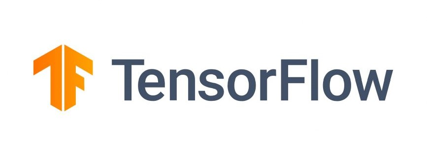
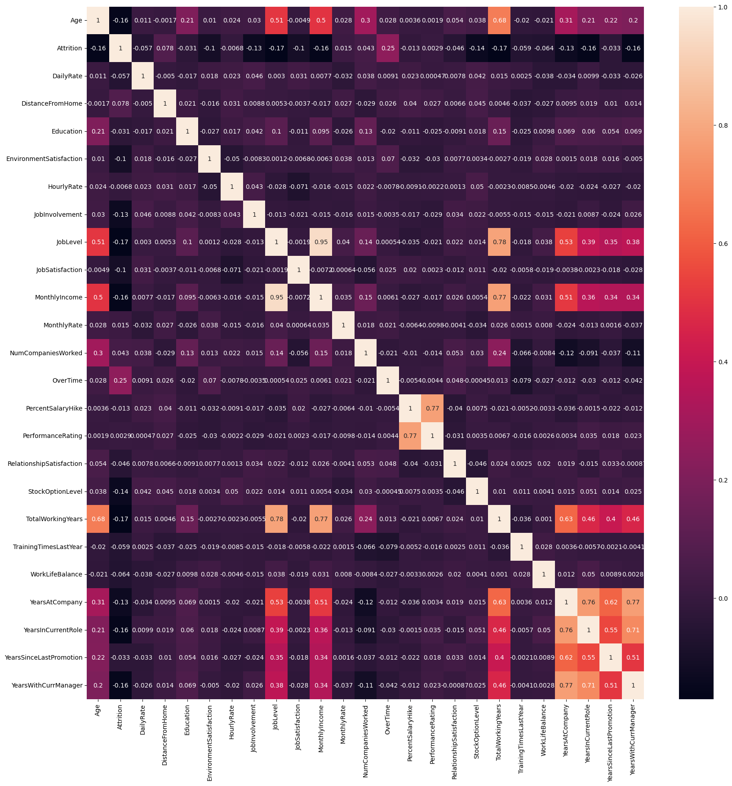
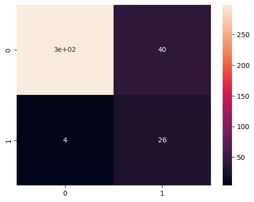
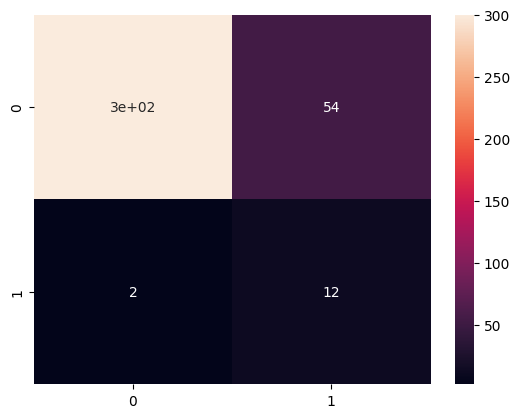
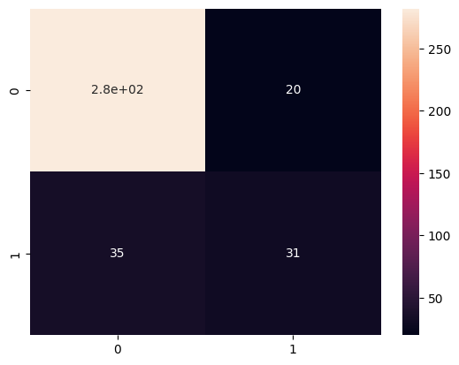

# Human-Resources-Project

---
      

## Introduction
This project focuses on using data science to address a key challenge in human resources. By analyzing employee data, I developed a model that helps **identify** those who may be at **risk of leaving**, helping a company to take proactive steps to retain valuable talent. This solution can help improve employee retention and overall company performance. 

## Problem Statement
This project addresses the problem by developing a data-driven solution to predict when an employee is likely to leave, enabling organizations to take timely actions to improve retention.

## Background
- Import libraries and datasets
- Visualize dataset
- Data cleaning
- Exploratory Data Analysis (EDA)
- Testing and Training dataset
- Train and evaluate Logistic Regression Classifier
- Train and evaluate Random Forest Classifier
- Train and evaluate Deep Learning Model

## Models Used
- Logistic Regression (LR)
- Random Forest Classifier (RFC)
- Deep Learning Model (DL)

## Data Sourcing
The dataset used in this project is a cleaned version of information extracted from human resources department. This processed data was prepared for building the predictive model.

## Data Transformation/Cleaning
The data was previously cleaned with a first ETL process, the only and last changes produced to it were:
1) To replace 'Attritition' and 'overtime' column with integers.
2) To remove unnecessary columns such as 'EmployeeCount', 'Over18' and 'Standardhours'.
3) To scale categorical features such as 'BusinessTravel', 'Department', 'EducationField', 'Gender', 'JobRole' and 'MaritalStatus'.

## Exploratory Data Analysis (EDA)
In this step, the principal objective was to:
- To visualize correlations between all features to find some tends.
  
- To compare dependent variable with less correlated independent variable.
- To graph and understand other correlations in values.

## Data Modeling
Prevously to create testing and training datasets, some data must have been scaled, such as categorical features 'BusinessTravel', 'Department', 'EducationField', 'Gender', 'JobRole' and 'MaritalStatus'.
Test size selected was 25%.

## Results of Prediction Models

LR         |         RFC         |          DL
:---------:|:-------------------:|:-----------------:
      |                |               

## Conclusions and Recommendations

In this project, I developed models to predict employee turnover, aiming to help the company retain key talent. Three models were evaluated: Logistic Regression, Random Forest, and a Deep Learning model. Among these, the **Logistic Regression model has achieved an accuracy of 0.88** and the lowest error rate, compared to _0.85 for both Random Forest and Deep Learning models_. Based on the results, I recommend implementing the Logistic Regression model for predicting employee turnover. Its higher accuracy and lower error rate make it the most reliable option for a possible retention strategy.

